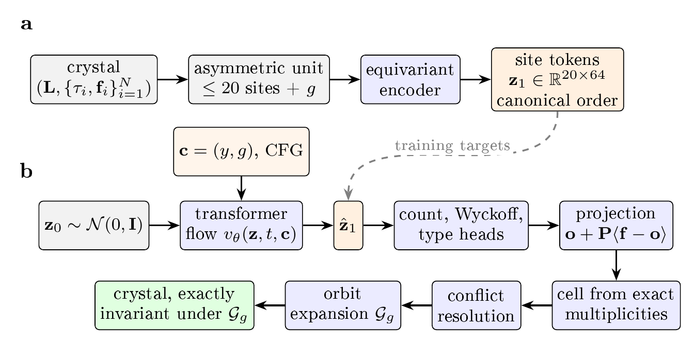

**SymmFlow: Symmetry-exact crystal generation by flow matching over asymmetric-unit site tokens.**

SymmFlow represents a crystal as canonically ordered latent tokens, one per site of the
asymmetric unit, learns their distribution by flow matching, and decodes every token onto an exact Wyckoff
subspace before regenerating the cell by orbit expansion. Every generated structure is therefore closed under its
space group by construction, and the space group can be requested at sampling time.

<p align="center"></p>


## Contents

1. [Repository layout](#repository-layout)
2. [Installation](#installation)
3. [Data](#data)
4. [Training](#training)
5. [Generating crystals](#generating-crystals)
6. [Evaluation and figures](#evaluation-and-figures)
7. [The symmetry correction (`symfix`)]
8. [Configuration](#configuration)
9. [Citation and licence](#licence)

## Repository layout

```
src/
  sitetokens.py        the model, losses, data pipeline and 3-stage training (11 numbered sections)
  symfix.py            stored-basis symmetry correction applied before generation
docs/                  architecture, training, evaluation and DFT notes
tests/                 hygiene and smoke tests that need no GPU
```

## Installation

```bash
git clone https://github.com/Eddah-Sure/SymmFlow.git
cd SymmFlow
python -m venv .venv && source .venv/bin/activate
# install PyTorch and PyTorch Geometric for your CUDA version first (see their install pages), then:
pip install -e ".[eval,dev]"
set -a; source .env; set +a
```

`pip install -e .` makes `import sitetokens` and `import symfix` work from anywhere, which is how the scripts
find the model.

## Data

The model trains on the mined MP-20 dataset (`train/ val/ test/`). 

## Training

All three stages run from one command. 

```bash
python src/sitetokens.py --data-root "$MP20_ROOT"
```

| Stage | What is trained | Defaults |
|---|---|---|
| 1. autoencoder pretraining | encoder, site decoder, structural heads | `run_encoder_pretrain` |
| 2. latent flow matching | flow and conditioner; the encoder stays frozen | 80 epochs, lr 2e-4 (`--flow-epochs`, `--flow-lr`) |
| 3. generative fine-tuning | flow and conditioner at lr, decoder and heads at a quarter of it | 30 epochs, lr 1e-4, 8 rollout steps (`--s3-epochs`, `--s3-lr`, `--s3-steps`, `--no-stage3`) |

Other flags: `--encoder-path`, `--target`, `--batch-size`, `--n-sites`, `--device`. Checkpoints are written to
`checkpoints/` (`EMF_CKPT_DIR`). Details: [`docs/TRAINING.md`](docs/TRAINING.md).

## Generating crystals

```bash
export EMF_CHECKPOINT=checkpoints/stage3_finetune.pt

# a figure of crystals generated under requested space groups, with the asymmetric unit
# outlined and Wyckoff labels (default: P-1, P2_1/c, R-3, P6_3/mmc, Fm-3m, three each)
python scripts/visualize.py --panel

# one generation trajectory with per-site diagnostics and an audited CIF
python scripts/visualize.py --target_energy -1.0 --num_crystals 3 --target_sg 225
```

The visualiser installs the symmetry correction before generating and refuses to run the panel without it.

## Evaluation and figures

`scripts/evaluate.py` (to be added, see [`scripts/README.md`](scripts/README.md)) writes an evaluation JSON.
`scripts/make_figures.py emf_eval_results.json` draws the results figures from that file only, so figures and text
cannot drift apart. See [`docs/EVALUATION.md`](docs/EVALUATION.md).


## The symmetry correction (`symfix`)

The orbit expansion in the model builds cells in a conventional basis that can differ from the basis in which the
Wyckoff codebook was mined. `symfix.install_stored_basis_symmetry` replaces it with expansion in the stored basis.
Any script that generates structures must install it before sampling; without it, cells come out several times too
large and some groups (e.g. `Pnma`) fail. `symfix` is applied automatically by `scripts/visualize.py`.

## Configuration

Locations come from environment variables (`.env.example`) or flags

```bash
python tools/check_private_paths.py
```

(also run by CI and, if you install it, by pre-commit: `pre-commit install`).

## Licence

Code is released under the
MIT licence, see [`LICENSE`](LICENSE). The Materials Project and MP-20 data have their own licences and are not
distributed here.
